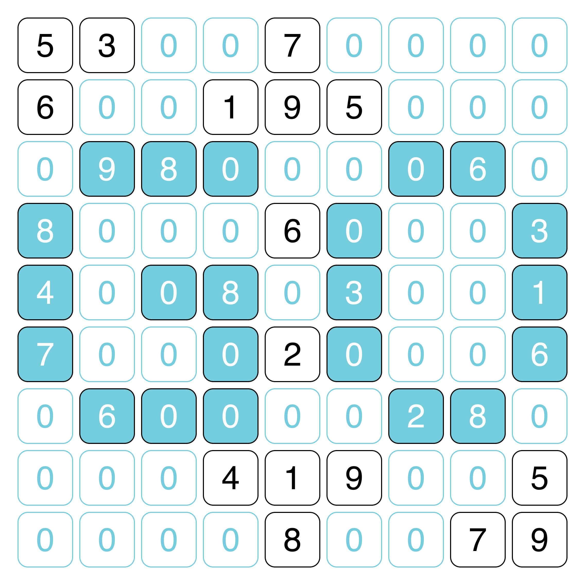
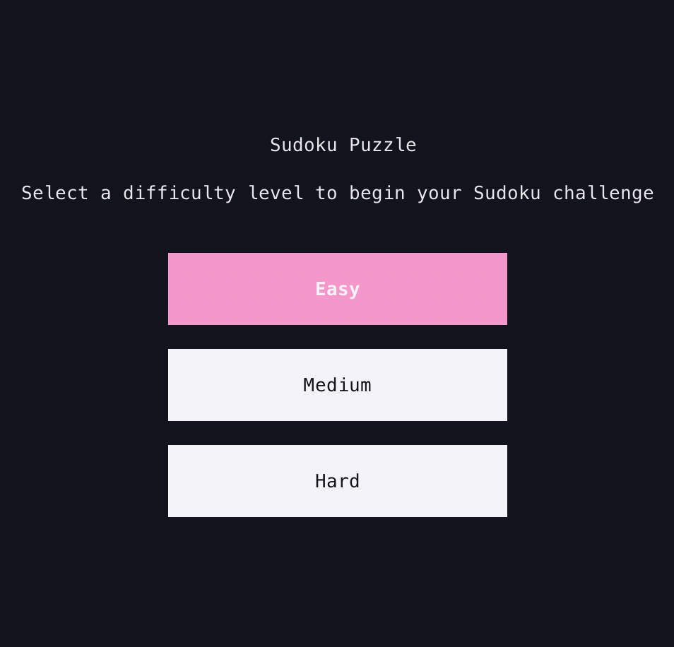
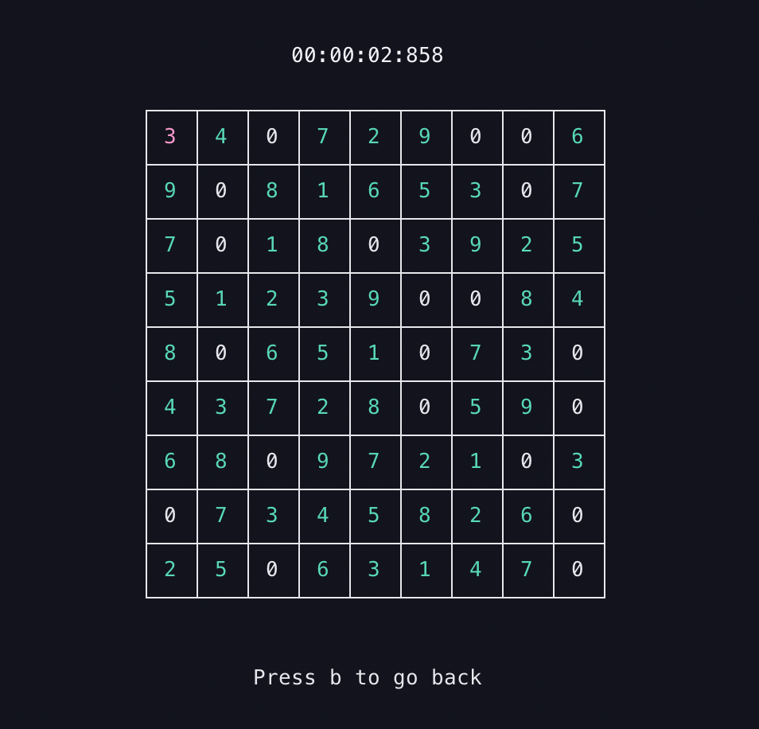

<div align="center" style="width: 100%;">
  

  <h1>Sugoku</h1>

  <p>Sugoku is a terminal-based Sudoku game written in Go. Dive into an engaging command-line experience and challenge yourself with uniquely generated puzzles right in your terminal.</p>
</div>

## Features

- **Terminal-Based Gameplay:** Play Sudoku directly in your terminal without needing a graphical interface.
- **User-Friendly Controls:** Easily navigate the grid using arrow keys and input numbers with your keyboard.
- **Puzzle Timer:** Keep track of your solution speed with a built-in timer that challenges you to beat your best time.

## Prerequisites

Before you begin, ensure you have the following installed:

- **Go (Golang):** Version 1.16 or higher is recommended.  
  Download from: [https://golang.org/dl/](https://golang.org/dl/)
- A compatible **terminal** to run the game.

## Installation

Follow these steps to install and run **Sugoku** locally:

1. **Clone the Repository:**

   ```bash
   git clone https://github.com/yourusername/sugoku.git
   cd sugoku
   ```

2. **Build the Application:**

   ```bash
   go build
   ```

   This command compiles the project and generates an executable file.

3. **Run the Game:**

   ```bash
   ./sugoku
   ```

   On Windows, run `sugoku.exe` instead.

## Usage

Once the game starts, you can begin playing immediately. Here are the key controls:

- **Navigation:**  
  Use the arrow keys to move between cells on the Sudoku board.
- **Inputting Numbers:**  
  Press a number key (1-9) to fill the selected cell.
- **Clearing a Cell:**  
  Press `0` or the backspace/delete key to clear a cell.
- **Game Commands:**
  - Press `b` to return to the main menu.
  - Press `q` to quit the game.

## Gameplay

<div style="display:flex">
  
  
</div>

The objective of Sudoku is to fill a 9x9 grid so that each row, each column, and each of the nine 3x3 sub-grids contains all of the digits from 1 to 9 exactly once. Sugoku offers puzzles at various difficulty levels.

### Game Loop

A typical game session involves:

- Loading or generating a new Sudoku puzzle.
- Allowing the player to navigate and input numbers.
- Validating the board in real-time.
- Highlighting any incorrect entries.
- Detecting when the puzzle is correctly completed.

## Future Developments

I'm continuously working to enhance Sugoku, adding exciting new features and improvements to elevate your gameplay experience. Stay tuned for upcoming updates such as:

- **Cell Note-Taking:** Easily mark potential numbers in each cell to refine your strategy.
- **Hints:** Get smart, context-aware tips to help you tackle challenging puzzles without giving away the solution.
- **Personal Record Keeping:** Automatically track your best times and progress, so you can see how you're improving over time.
- **Leaderboards:** Compete with sudoku enthusiasts around the world and climb the global rankings.
- **Mouse Interaction:** Upcoming updates will introduce intuitive mouse support, allowing you to select cells and navigate the board using point-and-click controls.

Hope you enjoy playing!
